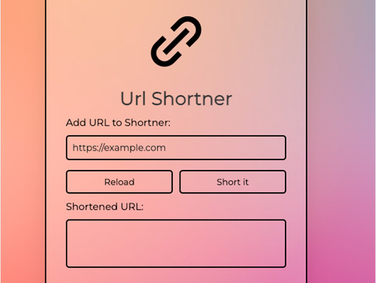

# Shorty

  

This is a basic url shortener similar to bitly but without the stats. The good part about it is that nothing is kept on any servers. However, url expires only when the app is turned off.

This was pure JS.

_This is a work in progress. I'm planning to make it more robust._